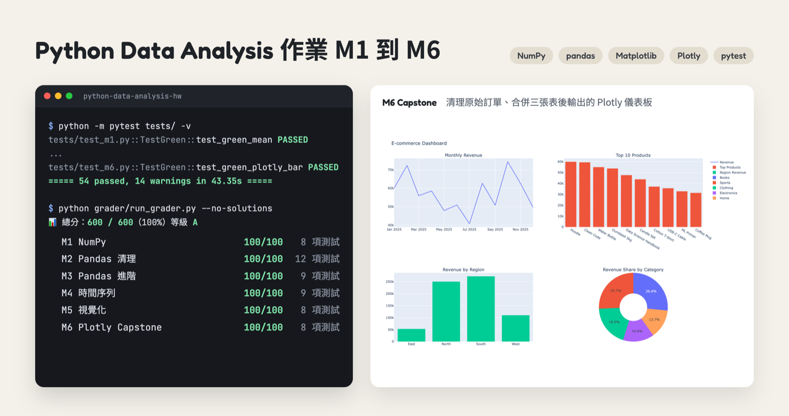
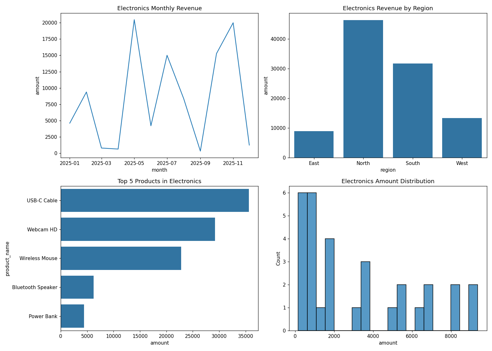
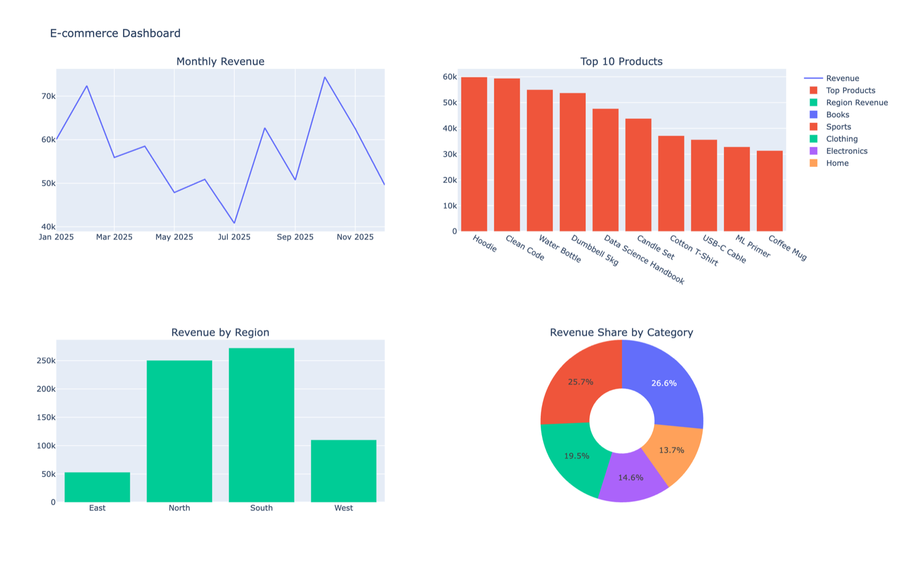
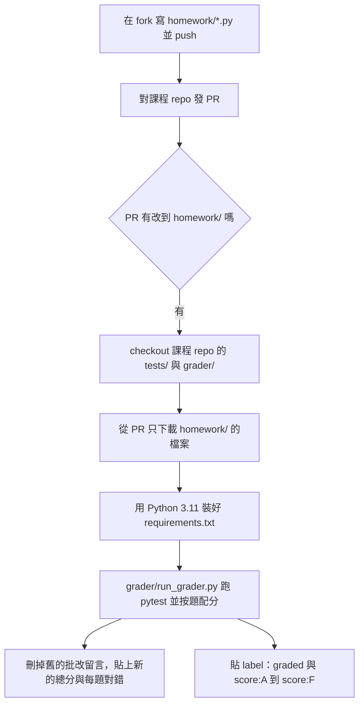

# Python 資料分析課程作業

> Coursework for a Python data analysis class: six auto-graded modules on NumPy, pandas, Matplotlib, Seaborn and Plotly.

本 repo fork 自課程作業範本 [Zenobia0000/python-da-homework-2026](https://github.com/Zenobia0000/python-da-homework-2026)。`homework/` 裡是 M1 到 M6 六份作業的解題程式碼，用同一份電商訂單資料從 NumPy 陣列一路做到 Plotly 互動儀表板，GitHub Actions 自動批改的結果是 600 / 600。

[](https://www.python.org/)


[](https://github.com/Zenobia0000/python-da-homework-2026/pull/30)



## 批改結果

作業用 [PR #30](https://github.com/Zenobia0000/python-da-homework-2026/pull/30)（Pull Request，請對方把修改合併進去的申請）交到課程 repo，批改機器人在 2026-05-03 留言給分，總分 600 / 600，等級 A。2026-09-18 用 Python 3.11 把同一份程式碼重跑一次，54 項測試全部通過，grader（批改程式 `grader/run_grader.py`）算出的分數相同。

| 模組 | 主題 | 測試數 | Actions 批改 | 本機重跑 |
|:--|:--|:-:|:-:|:-:|
| M1 | NumPy 向量化思維 | 8 | 100 / 100 | 8 passed |
| M2 | pandas 讀檔與資料清理 | 12 | 100 / 100 | 12 passed |
| M3 | pandas 進階：merge、groupby、RFM | 9 | 100 / 100 | 9 passed |
| M4 | 時間序列與 EDA（探索式資料分析） | 9 | 100 / 100 | 9 passed |
| M5 | Matplotlib 與 Seaborn 視覺化 | 8 | 100 / 100 | 8 passed |
| M6 | Plotly 互動儀表板與 Capstone（總結專題） | 8 | 100 / 100 | 8 passed |
| | **總計** | **54** | **600 / 600** | **54 passed** |

每個模組都分成送分題 30 分、核心題 45 分、挑戰題 25 分。一個函式可能對應好幾項測試，例如 M2 的挑戰題 `red_clean_orders()` 就拆成 6 項測試分別給分。

## 六個模組練了什麼

資料放在 `datasets/ecommerce/`，是一家電商 2025 年整年的範例資料：商品 30 筆、客戶 26 筆、清理前的訂單 210 筆，另外有清理後的訂單跟已經合併好客戶與商品欄位的版本（各 188 筆）。

### M1 NumPy 向量化思維

前三題是暖身：建立陣列算平均、整個陣列乘 2、用布林遮罩（boolean mask，拿一串 True／False 去挑元素）留下大於 25 的值。核心題改讀 `products.csv` 的單價與庫存，數出單價超過 1000 的商品、用 `np.argsort` 找庫存最多的前三名，再算單價低於 500 的商品各補 50 個要花多少錢。

挑戰題是雙 11 定價：庫存 100 以上打 7 折，20 到 99 打 9 折，其餘維持原價，用兩層 `np.where` 寫完。測試會把函式原始碼解析成 AST（abstract syntax tree，把程式碼拆成樹狀結構的表示法），裡面只要出現 for 或 while 迴圈就不給分。

### M2 pandas 讀檔與資料清理

`orders_raw.csv` 是故意弄髒的訂單檔：欄位名稱大小寫不一又帶空白，25 筆金額混著 `$` 跟千分位逗號，12 筆沒有日期，還有 10 列完全重複。核心題一次處理一種問題，包括欄位名稱去空白轉小寫、金額轉成浮點數（float）、`drop_duplicates()` 去重。清欄位名稱跟轉金額的兩個函式都先 `df.copy()`，不改動傳進來的 DataFrame（pandas 的表格物件）。

挑戰題 `red_clean_orders()` 把整套步驟串成一個函式。日期用 `pd.to_datetime(errors="coerce")` 轉換，轉不了的值會變成 NaT（pandas 表示「沒有時間」的空值），接著刪掉金額或日期是空值的列，最後去重。

### M3 pandas 進階：merge、groupby、RFM

先把 `orders_clean.csv` 依序 LEFT JOIN（以訂單表為主合併，對不到的欄位留空）客戶表與商品表，再用 `groupby` 回答三個問題：哪個商品類別營收最高、Gold 等級 VIP 下了幾張訂單與總金額多少、每個地區的平均訂單金額。

挑戰題是 RFM 分析（Recency 最近一次下單、Frequency 下單次數、Monetary 消費總額，常用來找出高價值客戶）。程式用 `groupby().agg()` 的 named aggregation（在 `agg()` 裡直接指定新欄位名稱與算法）一次算出 R、F、M 三個欄位，補上客戶名稱後依消費總額取前 5 名。

### M4 時間序列與 EDA

資料換成合併好的 `orders_enriched.csv`，改從時間的角度分析。送分題用 `.dt.month` 算各月份平均訂單金額，並找出訂單最多的三天。核心題用 `resample("ME")`（把每天的資料按月重新分組）算每月營收，用 `rolling(window=3)` 算 3 個月移動平均，再算各類別訂單金額的中位數。

挑戰題產出一張月報 DataFrame，每月一列，欄位有訂單數、營收、不重複客戶數、客單價，以及用 `pct_change()` 算出的月營收成長率。

### M5 Matplotlib 與 Seaborn 視覺化

用 Seaborn 畫了各類別訂單數長條圖、訂單金額直方圖（20 個 bin，也就是分組區間）、North 與 South 兩區的月營收折線圖、各 VIP 等級的金額箱形圖，以及單價對訂單金額的散佈圖，另外一題練習用 Matplotlib 設定標題與座標軸標籤。挑戰題 `red_category_dashboard()` 針對單一類別畫 2×2 的 subplot（子圖）儀表板，包含月營收趨勢、各地區營收、營收前 5 名商品、金額分布。



### M6 Plotly 互動儀表板與 Capstone

送分題用 Plotly Express 畫長條圖、折線圖、圓餅圖。核心題把 M2 的清理跟 M3 的合併串成一個 ETL（Extract、Transform、Load，把原始資料讀進來、整理好、交給分析）函式，接著算總營收、訂單數、活躍客戶數、平均客單價四個 KPI（關鍵績效指標），再畫一張滑鼠移到點上會顯示商品名稱的互動散佈圖。

挑戰題 `red_dashboard()` 從 `orders_raw.csv` 開始清理與合併，用 `make_subplots` 組出 2×2 儀表板：月營收趨勢、營收前 10 名商品、各地區營收、類別營收占比的環圈圖。



## 自動批改流程

批改寫在 workflow（GitHub Actions 的自動化流程設定）`.github/workflows/grade.yml`，跑在課程 repo 上。學生先把課程 repo fork（複製一份到自己帳號底下）來寫作業，再從自己的 fork 對課程 repo 發 PR，只要 PR 動到 `homework/`，就會觸發 `pull_request_target`（在目標 repo 的權限下執行的 PR 事件）。

workflow checkout（把 repo 檔案抓進執行環境）的是課程 repo 自己的 `tests/` 跟 `grader/`，再用 GitHub API 從 PR 只下載 `homework/` 裡的檔案。學生就算在 PR 裡改了測試檔，拿去跑的仍然是老師那一份。



`run_grader.py` 用 `pytest-json-report` 收集每項測試的結果，依照程式裡的配分表加總各模組分數，90% 以上是 A，往下每 10% 降一級，低於 60% 是 F。PR 開著的期間每 push 一次新的 commit，就會重新批改一次。

圖表題的測試只檢查回傳的物件型別跟結構，例如 M5 挑戰題要是 4 個 subplot 的 matplotlib Figure、M6 挑戰題要是至少有一個 trace（圖上的一組資料序列）的 Plotly Figure，圖的內容跟美觀不在自動批改範圍內。

另一個 workflow `collect-grades.yml` 由老師手動觸發，會掃過所有貼了 `graded` label 的 PR，匯出全班成績 `grades.csv`。

workflow 檔案也跟著 fork 過來，但 `grade.yml` 只有在有人對這個 repo 發 PR 時才會觸發，所以這個 repo 的 Actions 頁面沒有批改紀錄，紀錄都在課程 repo 的 PR #30。

| 元件 | 用途 |
|:--|:--|
| GitHub Actions | PR 觸發批改、留言、貼 label |
| pytest + pytest-json-report | 跑 54 項測試並輸出 JSON 結果 |
| `grader/run_grader.py` | 按題配分、產出 Markdown 批改報告 |
| NumPy、pandas | M1 到 M4 的計算與資料清理 |
| Matplotlib、Seaborn、Plotly | M5、M6 的圖表與儀表板 |

## 本機跑測試

```bash
git clone https://github.com/hsuiris/python-data-analysis-hw.git
cd python-data-analysis-hw
python3.11 -m venv .venv
source .venv/bin/activate
pip install -r requirements.txt

# 跑全部 54 項測試
python -m pytest tests/ -v

# 只測一個模組，例如 M3
python -m pytest tests/test_m3.py -v

# 用跟 GitHub Actions 同一支批改程式算分數
python grader/run_grader.py --no-solutions
```

測試裡的資料路徑是相對路徑（`datasets/ecommerce/...`），指令要在 repo 根目錄執行。課程範本沒有附 `solutions/`，所以跑 grader 要加 `--no-solutions`，不加的話每個模組的報告後面會多一行「解答模組未找到」。grader 會在根目錄產生 `grading_report.md`，內容就是 PR 留言的那份報告。

## 專案結構

```
├── homework/                 六份作業的解題程式碼（這個 fork 只改了這個資料夾）
│   ├── m1_numpy.py
│   ├── m2_pandas_cleaning.py
│   ├── m3_pandas_advanced.py
│   ├── m4_timeseries.py
│   ├── m5_visualization.py
│   └── m6_plotly_capstone.py
├── tests/                    每個模組一個 pytest 檔（課程提供）
├── grader/run_grader.py      跑 pytest、按題配分、產出批改報告（課程提供）
├── datasets/ecommerce/       商品、客戶、訂單 CSV
├── docs/
│   ├── STUDENT_GUIDE.md      Git、PR 與 CI/CD 學生操作手冊
│   ├── SUBMISSION_GUIDE.md   課程範本原本的繳交教學與老師專區
│   └── screenshots/
└── .github/workflows/
    ├── grade.yml             PR 自動批改
    └── collect-grades.yml    老師手動匯出全班成績
```

## 繳交教學

老師寫給全班的 fork、commit、發 PR 步驟在 [docs/STUDENT_GUIDE.md](docs/STUDENT_GUIDE.md)。原本 README 裡的常見錯誤排除（例如同一台電腦登入多個 GitHub 帳號造成的 permission denied）跟老師專區，都搬到 [docs/SUBMISSION_GUIDE.md](docs/SUBMISSION_GUIDE.md)。
